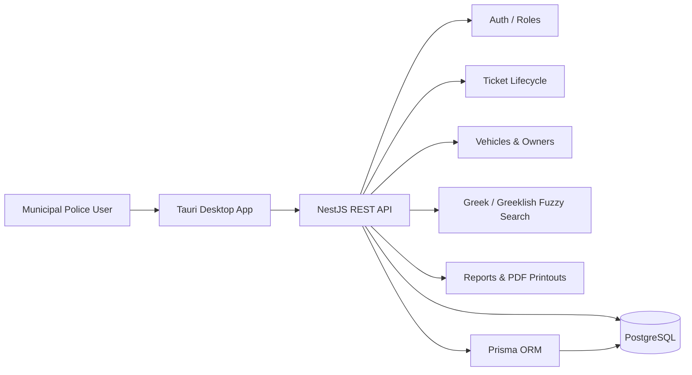
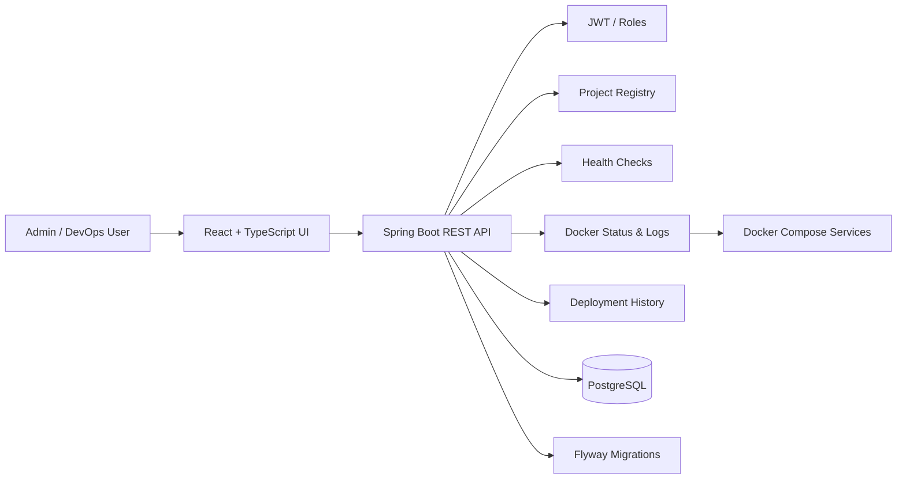

  

###

  

###

  

###

<h1 align="center">hey there 👋</h1>

###

<h3 align="left">👨‍💻 About Me</h3>

  📍 Based in Greece 🇬🇷   
  - 🎓 <b>Computer Science Student</b> focused on <b>full-stack development</b>, <b>DevOps practices</b> and <b>AI-assisted software engineering</b>. 
  - 🚀 Building real-world projects with modern <b>backend</b>, <b>frontend</b>, <b>database</b> and <b>deployment</b> technologies. 
  - 🧠 Interested in <b>AI-powered applications</b>, <b>automation tools</b>, <b>secure web systems</b> and <b>developer platforms</b>. 
  - ⚙️ Currently working with stacks used in my repositories: <b>Spring Boot</b>, <b>NestJS</b>, <b>React</b>, <b>TypeScript</b>, <b>PostgreSQL</b>, <b>Prisma</b>, <b>Docker</b> and <b>Tauri</b>. 
  - 🤖 Using AI tools as development assistants for architecture planning, code reviews, debugging and productivity workflows.

###

<h3 align="left">🚧 Currently Building</h3>

<table>
  <tr>
    <td width="50%">
      <h4>🏛️ <a href="https://github.com/spandreou/MunicipalPoliceProject">Municipal Police Management System</a></h4>
      
Modern desktop and backend platform for municipal police operations, ticket lifecycle, vehicle records, reports and Greek / Greeklish fuzzy violation search.

    </td>
    <td width="50%">
      <h4>⚙️ <a href="https://github.com/spandreou/DeployOps">DeployOps</a></h4>
      
Homelab deployment and monitoring platform with project registry, health checks, Docker service visibility, logs and deployment lifecycle tracking.

    </td>
  </tr>
  <tr>
    <td width="50%">
      <h4>⛽ <a href="https://github.com/spandreou/GasStationProject">Gas Station Shift Manager</a></h4>
      
Rule-based employee shift scheduling system with fairness rules, Sunday rotation, leave handling and custom business constraints.

    </td>
    <td width="50%">
      <h4>🏠 <a href="https://github.com/spandreou/homelabshare">Homelab / Automation</a></h4>
      
Self-hosted services, Docker-based automation, remote access workflows and server experiments around a personal homelab environment.

    </td>
  </tr>
</table>

###

<h3 align="left">🛠️ Tech Stack Used In My Projects</h3>

<h4 align="left">Backend</h4>

  
  
  
  
  

<h4 align="left">Frontend / Desktop</h4>

  
  
  
  
  

<h4 align="left">Database / ORM</h4>

  
  
  

<h4 align="left">DevOps / Deployment</h4>

  
  
  
  
  

<h4 align="left">Security / Auth</h4>

  
  
  

<h4 align="left">Tools & Workflow</h4>

  
  
  
  

###

<h3 align="left">🏗️ Architecture Diagrams</h3>

<h4 align="left">🏛️ Municipal Police Management System</h4>

<h4 align="left">⚙️ DeployOps</h4>

###

<h3 align="left">🚀 Featured Projects</h3>

<h4 align="left">🏛️ Municipal Police Management System</h4>

Modern desktop and backend system for municipal police operations.  
<b>Tech Stack:</b> NestJS, PostgreSQL, Prisma ORM, Tauri, TypeScript, REST APIs, PDF generation, fuzzy search, real-time updates.  
- Ticket lifecycle management 
- Vehicle and owner records 
- Greek / Greeklish fuzzy violation search 
- PDF printouts and reports 
- Admin diagnostics and operational tools

<h4 align="left">⚙️ DeployOps</h4>

Homelab deployment and monitoring platform for managing projects, health checks, Docker services and deployment history.  
<b>Tech Stack:</b> Java 21, Spring Boot, React, TypeScript, PostgreSQL, Docker, Docker Compose, JWT, Flyway.  
- Project registry 
- Health check history 
- Docker status and logs viewer 
- Role-based access control 
- Deployment lifecycle simulation

<h4 align="left">⛽ Gas Station Shift Manager</h4>

Shift scheduling system for gas station employees with custom business rules.  
<b>Tech Stack:</b> TypeScript, scheduling logic, rule-based generator, frontend planning.  
- Morning / afternoon / intermediate shift rules 
- Sunday 12-hour shift rotation 
- Leave and absence handling 
- Fairness rules and employee constraints

<h4 align="left">🏠 Homelab / Automation Projects</h4>

Personal server and automation environment for self-hosted tools and experiments.  
<b>Tech Stack:</b> Linux, Docker, Docker Compose, Cloudflare, Tailscale, Pi-hole, automation scripts.  
- Self-hosted services 
- Network-level ad blocking 
- Remote access workflows 
- Server automation experiments

###

<h3 align="left">📊 GitHub Stats</h3>

  
  

###

<h3 align="left">🔥 Contribution Streak</h3>

  

