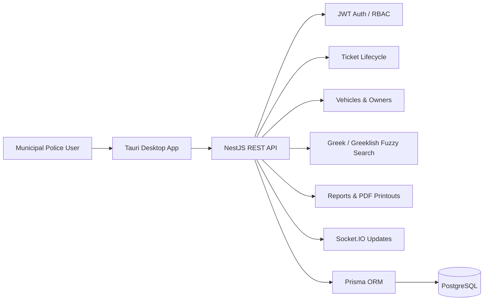
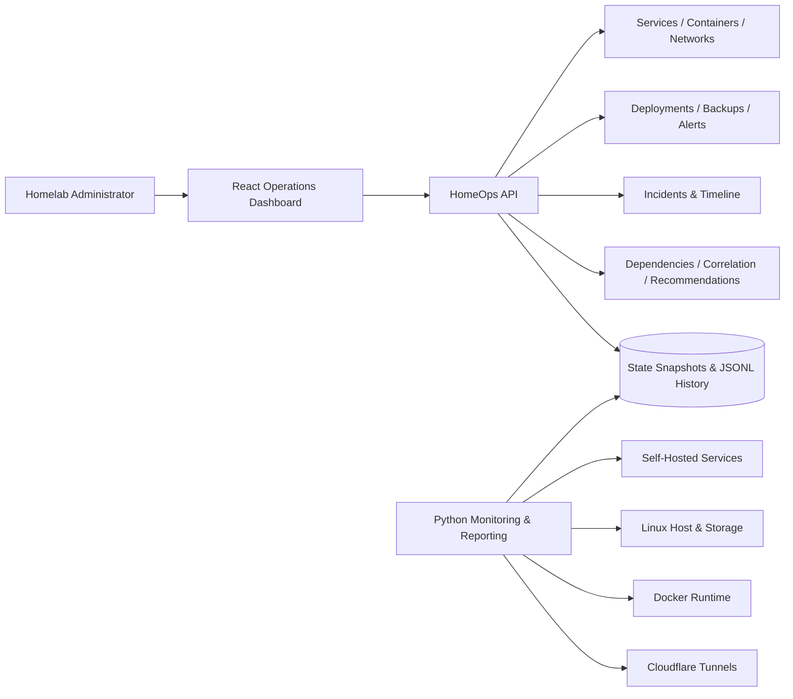
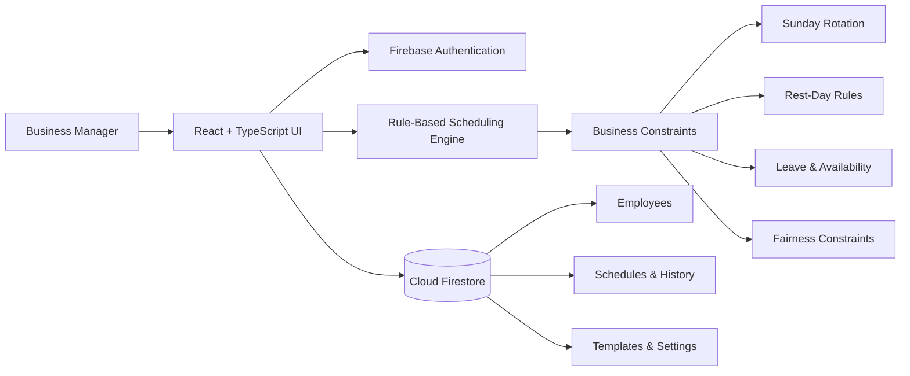

  

###

  
  

###

  

###

<h1 align="center">Hey, I'm Spyridon Andreou 👋</h1>

<b>Junior Full-Stack Developer | AI Automation & Integrations</b>

###

<h3 align="left">👨‍💻 About Me</h3>

  📍 Based in Greece 🇬🇷   
  - 🎓 <b>Digital Systems undergraduate</b> entering the final year at the <b>University of Thessaly</b>. 
  - 🚀 Focused on <b>full-stack development</b>, <b>AI automation and integrations</b>, <b>DevOps practices</b>, and <b>self-hosted infrastructure</b>. 
  - 🧩 Building end-to-end applications with authentication, RBAC, real-time communication, automation, testing, and production deployments. 
  - ⚙️ Working with <b>React</b>, <b>TypeScript</b>, <b>Java</b>, <b>Spring Boot</b>, <b>NestJS</b>, <b>PostgreSQL</b>, <b>Prisma</b>, <b>Docker</b>, <b>Linux</b>, and <b>Cloudflare</b>. 
  - 🤖 Using generative AI tools for agent-based workflows, structured integrations, architecture planning, debugging, testing, and productivity, with human validation of the output.

###

<h3 align="left">🚧 Currently Building</h3>

<table>
  <tr>
    <td width="50%">
      <h4>🏛️ <a href="https://github.com/spandreou/MunicipalPoliceProject">Municipal Police Management Platform</a></h4>
      
Desktop and API platform for municipal enforcement workflows, ticket lifecycle, vehicle records, audit history, Greek / Greeklish fuzzy search, real-time updates, and PDF reporting.

    </td>
    <td width="50%">
      <h4>🖥️ HomeOps</h4>
      
Central homelab operations dashboard for service health, containers, networks, Cloudflare tunnels, incidents, backups, alerts, history, dependency intelligence, and operational recommendations.

    </td>
  </tr>
  <tr>
    <td width="50%">
      <h4>🗓️ <a href="https://github.com/spandreou/GasStationProject">ShiftFlow</a></h4>
      
Production shift-planning application with rule-based schedule generation, drag-and-drop editing, rest-day constraints, history, analytics, templates, and exports.

    </td>
    <td width="50%">
      <h4>📁 <a href="https://github.com/spandreou/homelabshare">HomeLabShare</a></h4>
      
Self-hosted file-sharing platform with authentication, per-user quotas, uploads, share links, favourites, invite codes, and administration tools.

    </td>
  </tr>
</table>

###

<h3 align="left">🛠️ Tech Stack Used In My Projects</h3>

<h4 align="left">Backend</h4>

  
  
  
  
  

<h4 align="left">Frontend / Desktop</h4>

  
  
  
  
  
  

<h4 align="left">Database / ORM</h4>

  
  
  
  

<h4 align="left">DevOps / Deployment</h4>

  
  
  
  
  
  

<h4 align="left">AI & Automation</h4>

  
  
  
  
  
  

<h4 align="left">Security / Auth</h4>

  
  
  

<h4 align="left">Testing & Workflow</h4>

  
  
  
  
  

###

<h3 align="left">🏗️ Architecture Diagrams</h3>

<h4 align="left">🏛️ Municipal Police Management Platform</h4>

<h4 align="left">🖥️ HomeOps</h4>

<h4 align="left">🗓️ ShiftFlow</h4>

###

<h3 align="left">🚀 Featured Projects</h3>

<h4 align="left">🏛️ Municipal Police Management Platform</h4>

Desktop and API system for municipal enforcement operations.  
<b>Tech Stack:</b> React, TypeScript, Tauri, NestJS, PostgreSQL, Prisma, Socket.IO, Docker, Jest, Playwright, Cloudflare Tunnel.  
- JWT authentication and role-based access control 
- Ticket lifecycle, vehicle, owner, and plate-history management 
- Greek / Greeklish fuzzy violation search 
- Real-time updates, audit history, PDF printouts, and reports 
- Automated backend and end-to-end testing

<h4 align="left">🖥️ HomeOps</h4>

Central operations and observability workspace for a self-hosted homelab.  
<b>Tech Stack:</b> React, Node.js, Python, Docker, Linux, Cloudflare, JSON / JSONL state pipelines.  
- Service, host, storage, container, network, and tunnel visibility 
- Incidents, alerts, backups, operational history, and timelines 
- Dependency graph, incident correlation, recommendations, and intelligence scoring 
- Deployment operations integrated into the wider HomeOps control center 
- State-backed API design with monitoring and reporting automation

<h4 align="left">🗓️ ShiftFlow</h4>

Production shift-planning application with configurable business rules.  
<b>Tech Stack:</b> React, TypeScript, Firebase, Firestore, Zustand, dnd-kit, Vercel.  
- Rule-based schedule generation 
- Drag-and-drop editing and manual overrides 
- Rest-day, Sunday rotation, availability, and fairness constraints 
- History, analytics, templates, locking, and exports

<h4 align="left">📁 HomeLabShare</h4>

Self-hosted file-sharing platform with user-level access and administration tools.  
<b>Tech Stack:</b> Next.js, TypeScript, Prisma, PostgreSQL, Docker, Cloudflare Tunnel.  
- Authentication and per-user storage quotas 
- File and URL uploads, favourites, and recent items 
- Share links and invite-code workflows 
- Administration, search, sorting, and usage visibility

###

<h3 align="left">📊 GitHub Stats</h3>

  
  

###

<h3 align="left">🔥 Contribution Streak</h3>

  

